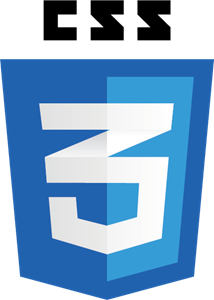

  

<h3 align="center">Project Title</h3>

---

 A react based dental clinic frontend.
      

## 📝 Table of Contents

- [About](#about)
- [Getting Started](#getting_started)
- [Built Using](#built_using)
- [Deployment](#deployment)
- [Usage](#usage)
- [Contributing](../CONTRIBUTING.md)
- [Authors](#authors)

## 🧐 About 

The purpose of the project is to show our knowledge of React, Redux and CSS.

## 🏁 Getting Started 

To run this app, you just need to run the backend using this link. You can find all the info about that step in the readme within.

https://github.com/devian5/saca-muelas-back

### Installing

There is nothing to install here. Just check the backend Repo.

## 🎈 Usage 

It's pretty simple. You have to use this website as you use any other one.

## ⛏️ Built Using 

    
    
    
    
    

    
## 🚀 Deployment 

Add additional notes about how to deploy this on a live system.

## ✍️ Authors 

- [@devian5](https://github.com/devian5) - Idea & Initial work

- [@DanielC1492](https://github.com/DanielC1492) - Idea & Initial work

See also the list of [contributors](https://github.com/FullStackDeveloperValenciaGeeksHubs0121) who participated in this project.

